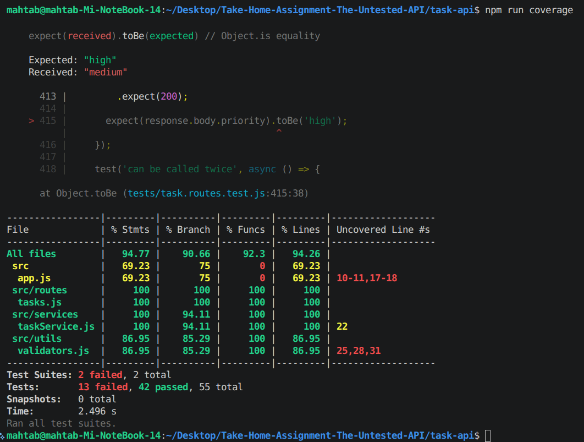

# Bug Report — Take-Home Assignment: The Untested API

## Test Summary

**Test command:**
```bash
npm test
```

**Result:**





**Coverage before fixes:** ~94.77% statements / 90.66% branches / 92.3% functions / 94.26% lines

The tests successfully identified several behavioral issues in the API.

---

## Bugs Found

### BUG-001: Pagination uses 0-based indexing instead of 1-based indexing
**Severity:** High
**Location:** `src/services/taskService.js`

```js
const getPaginated = (page, limit) => {
  const offset = page * limit;
  return tasks.slice(offset, offset + limit);
};
```

**Expected behavior**
The API documentation specifies `GET /tasks?page=1&limit=10` with 1-based page numbers.

For example, with three tasks (Task 1, Task 2, Task 3):
- `page=1&limit=2` → Task 1, Task 2
- `page=2&limit=2` → Task 3

**Actual behavior**
`offset = page * limit`. For `page=1&limit=2`, offset becomes `1 * 2 = 2`, so the first page starts with Task 3. The second page then starts beyond the end of the array and returns nothing.

Observed test failure:
```
Expected length: 2
Received length: 1
Received: Task 3
```

**How it was discovered**
- `taskService › getPaginated() › returns the first page using 1-based page numbers` — failed
- `Task API routes › GET /tasks pagination › returns first page` — failed

**Suggested fix**
```js
const offset = (page - 1) * limit;
```

**Regression test**
- `page=1, limit=2` → Task 1, Task 2
- `page=2, limit=2` → Task 3

---

### BUG-002: Invalid pagination parameters are silently accepted
**Severity:** Medium
**Location:** `src/routes/tasks.js`

```js
const pageNum = parseInt(page) || 1;
const limitNum = parseInt(limit) || 10;
```

**Expected behavior**
Invalid values like `/tasks?page=abc&limit=xyz` should return `400 Bad Request`. Pagination values should be validated as positive integers.

**Actual behavior**
`parseInt('abc') || 1` → `pageNum = 1`; `parseInt('xyz') || 10` → `limitNum = 10`. The API returns `200 OK` with `[]` instead of rejecting the request.

**How it was discovered**
`Task API routes › GET /tasks pagination › handles invalid pagination parameters` failed with: `expected 400 "Bad Request", got 200 "OK"`

**Suggested fix**
```js
const pageNum = Number(page);
const limitNum = Number(limit);

if (
  !Number.isInteger(pageNum) ||
  !Number.isInteger(limitNum) ||
  pageNum < 1 ||
  limitNum < 1
) {
  return res.status(400).json({
    error: 'page and limit must be positive integers',
  });
}
```

Should also reject `page=1.5`, `limit=1.5`, `page=0`, `limit=0`, `page=-1`, `limit=-10`.

---

### BUG-003: Task ID can be modified through PUT
**Severity:** High
**Location:** `src/services/taskService.js`

```js
const updated = { ...tasks[index], ...fields };
```

**Expected behavior**
The task ID is generated on creation and should remain immutable. A request body of `{ "id": "HACKED-ID" }` should not change the task's ID.

**Actual behavior**
The spread lets `fields.id` overwrite the original ID. Result: `{ "id": "HACKED-ID" }`, and the original task can no longer be found by its original UUID.

**How it was discovered**
`taskService › update() › does not allow immutable id to be changed` failed:
```
Expected: original UUID
Received: HACKED-ID
```
The integration test produced the same result.

**Suggested fix**
Only copy mutable fields:
```js
const {
  title,
  description,
  status,
  priority,
  dueDate,
} = fields;

const updated = {
  ...tasks[index],
  ...(title !== undefined && { title }),
  ...(description !== undefined && { description }),
  ...(status !== undefined && { status }),
  ...(priority !== undefined && { priority }),
  ...(dueDate !== undefined && { dueDate }),
};
```
This prevents clients from modifying `id`, `createdAt`, and `completedAt` through the general update endpoint.

---

### BUG-004: `createdAt` can be modified through PUT
**Severity:** High
**Location:** `src/services/taskService.js` (same root cause as BUG-003)

**Expected behavior**
`createdAt` represents when the task was created and should be immutable.

**Actual behavior**
`{ "createdAt": "2000-01-01T00:00:00.000Z" }` overwrites the original creation timestamp.

**How it was discovered**
Unit and integration tests attempting to modify `createdAt` both failed:
```
Expected: original createdAt
Received: 2000-01-01T00:00:00.000Z
```

**Suggested fix**
Do not allow `createdAt` in the updateable fields — only explicitly copy supported mutable properties.

---

### BUG-005: `completedAt` can be modified directly through PUT
**Severity:** High
**Location:** `src/services/taskService.js` (same root cause)

**Expected behavior**
`completedAt` should only be controlled by `PATCH /tasks/:id/complete`. A normal PUT should not allow clients to forge the completion timestamp.

**Actual behavior**
`{ "completedAt": "2000-01-01T00:00:00.000Z" }` succeeds and modifies the task.

**How it was discovered**
`PUT /tasks/:id › does not allow completedAt to be changed` failed:
```
Expected: null
Received: 2000-01-01T00:00:00.000Z
```

**Suggested fix**
Do not include `completedAt` in the fields accepted by `update()`. It should only be set by `completeTask()`.

---

### BUG-006: Arbitrary unknown fields can be added to tasks
**Severity:** Medium
**Location:** `src/services/taskService.js`

```js
const updated = { ...tasks[index], ...fields };
```

**Expected behavior**
The API should only update fields defined by the Task model. `{ "foo": "bar" }` should either return `400 Bad Request` or be ignored — it should not permanently add arbitrary properties.

**Actual behavior**
The field is added: response contains `"foo": "bar"`.

**How it was discovered**
`PUT /tasks/:id › does not accept arbitrary fields` failed:
```
Expected: undefined
Received: "bar"
```

**Suggested fix**
Validate allowed update fields, e.g.:
```js
const allowedFields = ['title', 'description', 'status', 'priority', 'dueDate'];
```
Reject unknown properties with `400 Bad Request`, or explicitly whitelist fields before updating.

---

### BUG-007: Completing a task unexpectedly changes its priority
**Severity:** Medium
**Location:** `src/services/taskService.js`

```js
const updated = {
  ...task,
  priority: 'medium',
  status: 'done',
  completedAt: new Date().toISOString(),
};
```

**Expected behavior**
Completing a task should change `status → done` and `completedAt → current timestamp`, while preserving unrelated properties, including `priority`.

**Actual behavior**
`priority: 'medium'` is forced regardless of the original priority — a high-priority task becomes medium priority after completion.

**How it was discovered**
`taskService › completeTask() › preserves priority when completing a task` failed:
```
Expected: "high"
Received: "medium"
```
The integration test for `PATCH /tasks/:id/complete` also failed.

**Suggested fix**
Remove the hard-coded priority:
```js
const updated = {
  ...task,
  status: 'done',
  completedAt: new Date().toISOString(),
};
```

---

### BUG-008: `completeTask()` allows repeated completion and resets `completedAt`
**Severity:** Low / Medium
**Location:** `src/services/taskService.js`

```js
completedAt: new Date().toISOString(),
```

**Expected behavior**
The API contract should define behavior for an already-completed task. A reasonable approach: make completion idempotent — repeated calls should not change the original `completedAt`. Alternatively, return `400`/`409` for an already-completed task.

**Actual behavior**
Calling the endpoint twice returns `200 OK` both times and overwrites `completedAt`:
- First call: `2026-08-15T07:51:06.111Z`
- Second call: `2026-08-15T07:51:48.730Z`

**How it was discovered**
Manual testing with `curl -i -X PATCH http://localhost:3000/tasks/<id>/complete`, called twice.

**Suggested fix**
```js
if (task.status === 'done') {
  return task;
}
```

---

### BUG-009: `getByStatus()` uses substring matching
**Severity:** Medium
**Location:** `src/services/taskService.js`

```js
const getByStatus = (status) => tasks.filter((t) => t.status.includes(status));
```

**Expected behavior**
Documented statuses are `todo`, `in_progress`, `done`. Filtering should be an exact match — `/tasks?status=todo` should return only tasks whose status is exactly `todo`.

**Actual behavior**
`includes()` instead of `===` means partial matches succeed, e.g. `'in_progress'.includes('progress')` is `true`.

**Suggested fix**
```js
const getByStatus = (status) =>
  tasks.filter((t) => t.status === status);
```
The route should also validate that the requested status is one of the three valid values.

---

### BUG-010: `description` is not type-validated
**Severity:** Medium
**Location:** `src/utils/validators.js`

`validateCreateTask()` validates `title`, `status`, `priority`, and `dueDate`, but not `description`.

**Expected behavior**
Per the Task shape, `description` should be a string (or `null` if intentionally supported).

**Actual behavior**
Both of the following return `201 Created`:
```json
{ "title": "Invalid Description Test", "description": 123 }
{ "title": "Object Description Test", "description": { "foo": "bar" } }
```

**How it was discovered**
Manual API testing.

**Suggested fix**
```js
if (
  body.description !== undefined &&
  body.description !== null &&
  typeof body.description !== 'string'
) {
  return 'description must be a string';
}
```
Apply the same validation on updates.

---

### BUG-011: `null` status and priority are accepted
**Severity:** Medium
**Location:** `src/utils/validators.js`

```js
if (body.status && !VALID_STATUSES.includes(body.status)) {
if (body.priority && !VALID_PRIORITIES.includes(body.priority)) {
```

**Expected behavior**
If `status`/`priority` must contain one of the documented values, `null` should be rejected.

**Actual behavior**
Truthiness checks mean `null` skips validation entirely — `{ "status": null }` and `{ "priority": null }` are both accepted and stored as `null`.

**Suggested fix**
```js
if (
  body.status !== undefined &&
  !VALID_STATUSES.includes(body.status)
) {
  return `status must be one of: ${VALID_STATUSES.join(', ')}`;
}
```
Apply the same pattern for `priority`.

---

### BUG-012: Empty string is accepted for `dueDate`
**Severity:** Medium
**Location:** `src/utils/validators.js`

```js
if (body.dueDate && isNaN(Date.parse(body.dueDate))) {
```

**Expected behavior**
Documented type is `ISO string | null`. An empty string is not a valid ISO date.

**Actual behavior**
`{ "dueDate": "" }` is accepted and stored as `""`, because `""` is falsy and the check is skipped.

**Suggested fix**
```js
if (
  body.dueDate !== undefined &&
  body.dueDate !== null &&
  (
    typeof body.dueDate !== 'string' ||
    isNaN(Date.parse(body.dueDate))
  )
) {
  return 'dueDate must be a valid ISO date string';
}
```

---

### BUG-013: Pagination accepts decimal values
**Severity:** Medium
**Location:** `src/routes/tasks.js`

```js
const pageNum = parseInt(page) || 1;
const limitNum = parseInt(limit) || 10;
```

**Expected behavior**
`page` and `limit` should be positive integers.

**Actual behavior**
`/tasks?page=1.5&limit=1.5` is accepted — `parseInt('1.5')` becomes `1`, and the request returns `200 OK`.

**Suggested fix**
Same strict integer validation as BUG-002.

---

## Test Coverage

| Statements | Branch | Functions | Lines |
|---|---|---|---|
| 94.77% | 90.66% | 92.3% | 94.26% |

This exceeds the assignment's requested **80%+ coverage** target.

The failing tests are valuable because they are not simply coverage tests — they identify actual behavioral problems in the implementation.

---

## Recommended Bug Fix Priority

### Priority 1 — Fix before production
- Pagination off-by-one error
- ID mutation
- `createdAt` mutation
- `completedAt` mutation
- Arbitrary field injection
- Invalid status/priority values
- Invalid pagination parameters

These can cause incorrect data or violate the API's data model.

### Priority 2
- Preserve priority when completing a task
- Validate `description` type
- Validate `dueDate`
- Exact status filtering

### Priority 3
- Define behavior for completing an already-completed task
- Improve error messages and API validation consistency

---

## Part B — Recommended Bug Fix

The first bug to fix should be **pagination**, because it directly violates the documented API behavior.

**Current:**
```js
const getPaginated = (page, limit) => {
  const offset = page * limit;
  return tasks.slice(offset, offset + limit);
};
```

**Fix:**
```js
const getPaginated = (page, limit) => {
  const offset = (page - 1) * limit;
  return tasks.slice(offset, offset + limit);
};
```

The existing failing tests should then pass:
- `page=1&limit=2` → Task 1, Task 2
- `page=2&limit=2` → Task 3

---

## Part C — New Feature

The assignment also requires `PATCH /tasks/:id/assign` with body:
```json
{ "assignee": "string" }
```

**Recommended behavior:**

| Scenario | Request | Response |
|---|---|---|
| Valid request | `{ "assignee": "Alice" }` | `200 OK`, task stores `{ "assignee": "Alice" }` |
| Empty assignee | `{ "assignee": "" }` | `400 Bad Request` (whitespace-only strings should also be rejected) |
| Invalid type | `{ "assignee": 123 }` | `400 Bad Request` |
| Non-existent task | — | `404 Not Found` |
| Already assigned task | — | Behavior should be clarified before implementation (a reasonable default is `409 Conflict` unless reassignment is explicitly intended) |

---

## Conclusion

The test suite successfully exceeded the requested 80% coverage target and identified multiple real defects. The most significant issues relate to:

- Incorrect pagination
- Insufficient update-field protection
- Mutation of immutable fields
- Weak input validation
- Incorrect completion behavior

The test failures provide reproducible evidence for these bugs and can be used as regression tests once the fixes are implemented.
